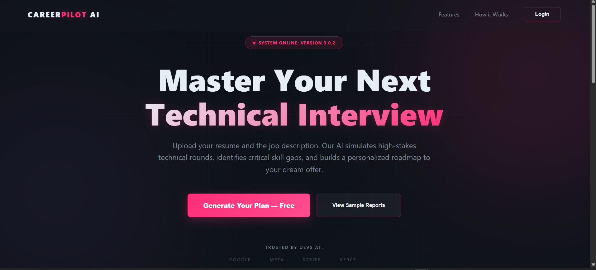
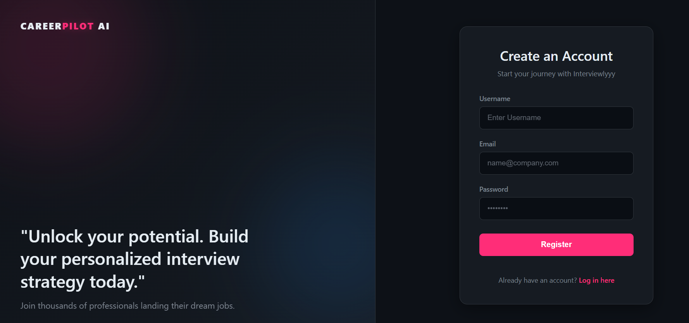
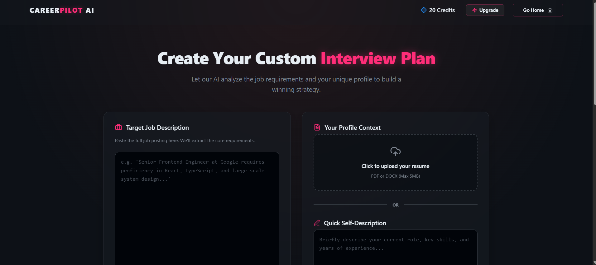
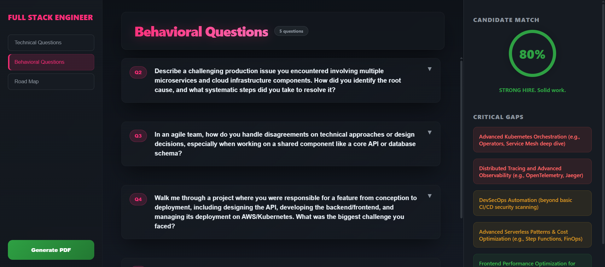
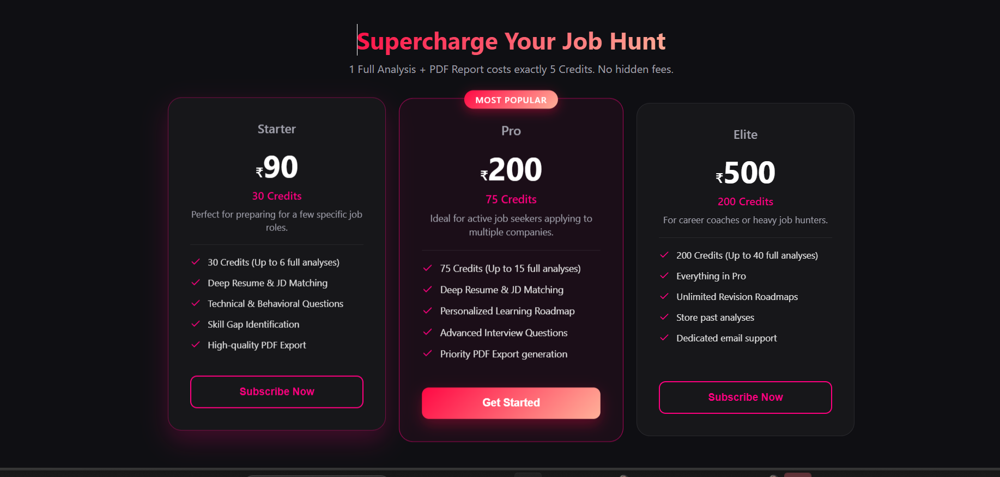

🚀 CareerPilot AI – AI Resume Analysis & Interview System

Stop guessing. Start improving with data-driven feedback.
CareerPilot AI analyzes your resume against job descriptions, identifies skill gaps, and helps you prepare for interviews using AI.

🌐 Live Demo

👉 https://careerpilotai-frontend.vercel.app

📌 What This Project Solves

Most candidates apply to jobs without understanding why they get rejected.

They don’t know whether their resume actually matches the role, what skills they are missing, or how to prepare for interviews in a structured way. As a result, they keep applying blindly and repeating the same mistakes.

CareerPilot AI was built to solve this problem.

Instead of giving generic advice, the system analyzes your resume against a specific job description and provides clear, structured feedback. It shows where you stand, what you are missing, and how to improve — all in one place.

The goal is simple: remove guesswork and replace it with actionable insights.

⚙️ How the System Works

The platform takes two inputs — your resume and a job description.

From there, the system processes both using AI and produces a complete analysis flow:

It compares your resume with the job description to evaluate match quality
It identifies missing or weak skills affecting your chances
It generates interview questions tailored to your profile and role
It rewrites your resume to better align with job requirements
It produces a structured report with clear improvement steps

Everything is connected into one pipeline, so users don’t need multiple tools.

🧠 What Makes This Different

Most tools only solve one part of the problem.

CareerPilot AI combines everything into a single system:

Resume analysis is job-specific, not generic
Feedback is precise and actionable, not vague
Interview preparation is based on your resume and role
Resume rewriting is context-aware, not template-based

This makes the output far more useful and practical.

## 🖼️ Screenshots

### 📝 Register

### 📊 Dashboard

### 📄 Resume Analysis Report

### 💳 Pricing

⚙️ System Architecture
Frontend handles UI, user interaction, and state management
Backend manages APIs, authentication, and data flow
AI layer processes resume and job data using LLMs

Flow:

User → Upload Resume → Backend → AI Processing → Match Score → Report + Questions

🧠 Tech Stack
   Frontend
   React.js
   Tailwind CSS
   Axios
   Backend
   Node.js
   Express.js
   AI Integration
   OpenAI API / Gemini API
   LLM-based processing
   Database
   MongoDB / PostgreSQL
   Other
   JWT Authentication
   Rate Limiting
   PDF Generation
💰 Monetization Model

The platform follows a freemium model:

Free users get limited analysis
Paid users unlock:
Resume rewriting
Interview questions
Skill roadmap
PDF export
⚙️ Installation & Setup
1. Clone the repository
git clone https://github.com/Curious-Firdosh/CareerPilotAI.git
cd CareerPilotAI
2. Install dependencies
npm install
3. Setup environment variables

Create a .env file:

PORT=5000
MONGO_URI=your_database_url
JWT_SECRET=your_secret
AI_API_KEY=your_api_key
4. Run the application
npm run dev
📈 Future Improvements
Resume performance tracking dashboard
AI-based job application automation
Chrome extension for job platforms
Mobile responsiveness improvements
🧑‍💻 Author

Firdosh Khan
🌐 https://fridosh-portfolio.vercel.app/

⭐ Contributing

Contributions are welcome.
Feel free to open issues or submit pull requests.

📜 License

MIT License

💡 Final Note

This is not just a resume tool.
It is a system designed to help users understand exactly where they stand and what they need to improve to get shortlisted.
